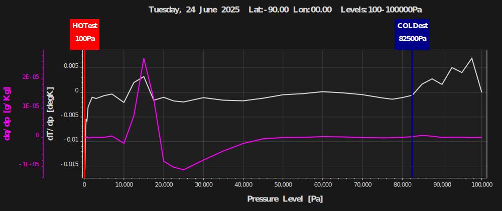
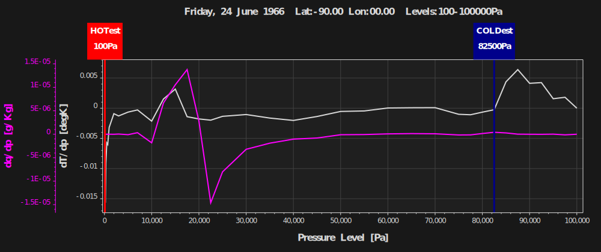
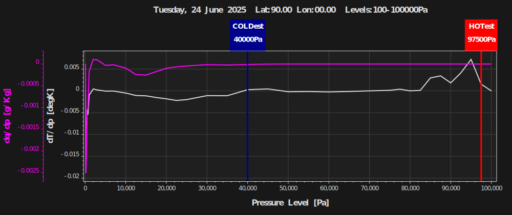
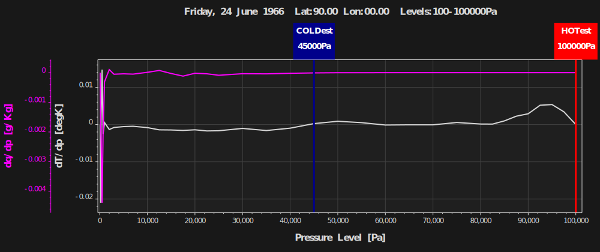

  
----------
   
> **Attributtion on Data origin.**   
> Copernicus Climate Change Service, Climate Data Store, (2024): ERA5 post-processed daily-statistics on pressure levels from 1940 to present. Copernicus Climate Change Service (C3S) Climate Data Store (CDS), DOI: 10.24381/cds.50314f4c (Accessed on 20-07-2025) See Conditions there.    

> License: "ScottPlot was created by Scott W Harden and enhanced by many contributions from the open-source community. It is provided under the permissive MIT license and is free to modify and use for any purpose".    

> Free Edition licensing. "Our flagship products (ALGLIB for C++ and ALGLIB for C#) are distributed under GPL 2+ license, which is not suited for commercial distribution; other products are distributed under Personal and Academic Use License".